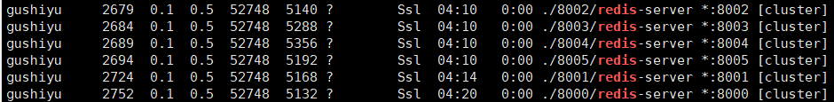

# Redis Cluster 集群

#### 简介

为了提供高可用高并发的水平拓展,就必须采用集群。

一组Redis Cluster是由多个Redis实例组成，**官方推荐我们使用6实例**，其中3个为主节点，3个为从结点。一旦有主节点发生故障的时候，Redis Cluster可以选举出对应的从结点成为新的主节点，继续对外服务，从而保证服务的高可用性。

Redis Cluster 把所有的数据划分为16384个不同的槽位，可以根据机器的性能把不同的槽位分配给不同的Redis实例，对于Redis实例来说，他们只会存储部门的Redis数据.

槽的数据是可以迁移的，不同的实例之间，可以通过一定的协议，进行数据迁移。

#### 如何获取集群中的数据

客户端是如何访问Redis Cluster里面的数据呢？首先客户端需要保存一份Redis Cluster槽相关的信息，也就是路由表，然后对即将访问的key进行哈希计算，计算出对应的槽位，然后向对应的Redis实例发起查询请求。如果访问的Redis实例中，的确保存着对应槽的数据信息，就会进行返回，否则向客户端返回一个Moved指令，让客户端到正确的地址进行获取。

#### 如何进行拓展

当你新增一些实例的时候，只需要将一部分槽位迁移到新的实例即可(自动)。在迁移的过程中，客户端会先去旧的实例上去查询数据，因为迁移正在发生，如果对应的数据还在本机上，那么直接返回，否则返回让客户端重定向到新的实例。客户端先向新的机器发起ask指令，新实例返回成功后，再一次查询最终的结果。

#### Redis的集群方案

-   Twitter 开发的 twemproxy
-   豌豆荚开发的codis
-   Redis官方的redis-cluster   redis3.0之后才支持

最好的就是redis-cluster 官方支持

#### 数据分布

##### **为什么要做数据分布**  

全量数据，单机Redis节点无法满足要求，按照分区规则把数据分到若干个子集当中


##### 常见的数据分布方式

###### **顺序分布**

1到100个数字，要保存在3个节点上，按照顺序分区，把数据平均分配三个节点上 1号到33号数据保存到节点1上，34号到66号数据保存到节点2上，67号到100号数据保存到节点3上

###### **哈希分布**

例如1到100个数字，对每个数字进行哈希运算，然后对**每个数的哈希结果除以节点数进行取余**，余数为1则保存在第1个节点上，余数为2则保存在第2个节点上，余数为0则保存在第3个节点，这样可以保证数据被打散，同时保证数据分布的比较均匀

**节点取余分区方式建议使用多倍扩容的方式**，例如以前用3个节点保存数据，扩容为比以前多一倍的节点即6个节点来保存数据，这样只需要适移50%的数据。数据迁移之后，第一次无法从缓存中读取数据，必须先从数据库中读取数据，然后回写到缓存中，然后才能从缓存中读取迁移之后的数据

###### 虚拟槽分区 哈希的一种

**虚拟槽分区是Redis Cluster采用的分区方式**

预设虚拟槽，每个槽就相当于一个数字，有一定范围。每个槽映射一个数据子集，一般比节点数大,Redis Cluster中预设虚拟槽的范围为0到16383


图中应为取余运算

步骤

1.  把16384槽按照节点数量进行平均分配，由节点进行管理 

2.  对每个key按照CRC16规则进行hash运算 

3.  把hash结果对16383进行取余 

4.  把余数发送给Redis节点 

5.  节点接收到数据，验证是否在自己管理的槽编号的范围    如果在自己管理的槽编号范围内，则把数据保存到数据槽中，然后返回执行结果    如果在自己管理的槽编号范围外，则会把数据发送给正确的节点，由正确的节点来把数据保存在对应的槽中

**Redis Cluster的节点之间会共享消息，每个节点都会知道是哪个节点负责哪个范围内的数据槽**

###### 顺序分布与哈希分布的对比


#### Redis Cluster 基本架构

##### 节点

reids cluster是分布式架构:集群中有多个节点,每个节点都负责进行地写操作,每个节点之间会进行通信

##### meet操作   (会面)

节点之间会进行相互通信,以便完成数据的共享,meet是节点之间完成相互通讯的基础,meet操作有着一定的频率和规则 

##### 分配槽

把16384个槽平均分配给节点进行管理，每个节点只能对自己负责的槽进行读写操作

由于每个节点之间都彼此通信，每个节点都知道另外节点负责管理的槽范围


##### 主从复制

保证高可用，每个主节点都有一个从节点，当主节点故障，Cluster会按照规则实现主备的高可用性

对于节点来说，有一个配置项：cluster-enabled，即是否以集群模式启动

##### 客户端路由

###### moved重定向

当客户端发送命令到集群的任意一个节点时如果key指向的槽在自己身上则执行命令,如果不在自己身上则向客户端返回正确的节点,然后客户端在去重新发送命令给正确的节点 


###### ask重定向

在进行集群扩容和缩容的时候,当客户端像一个正确(指槽命中)的节点发送命令时,槽和槽中的数据已经转移到别的节点了就会返回ask异常,客户端会使用asking 命令给新的节点,然后在发送命令,得到数据


###### moved重定向与ask重定向的相同点和不同点

moved指槽和数据已经确定迁移,槽不在当前节点

ask指槽和数据正在迁移中

##### 多节点命令

在集群中如果想要获取某一批数据很有可能在所有集群上都会进行遍历操作

而且reids不支持扫描所有节点

所以多节点命令就是在所有节点都执行一条命令在汇总

###### 串行操作

就是去挨个访问每一个节点然后在汇总,简单,效率不高,n个节点需要n次网络时间

###### 串行IO

对查询的数据进行优化在客户端对key按节点进行分组(照槽和节点的对应,使用 CRC16hash%16383) 然后相应组发送给相应的节点减少了网络开销.

###### 并行IO

对串行进行改造使用多线程去相对应节点进行发送消息

###### hash_tag

同一类型的数据使用相同的hash_tag 就会确保所有的key指向一个节点请求数据这样就可以只去一个节点取数据

###### 四种方案对比


##### 故障发现

redis 通过ping pong 消息实现故障发现 , 不需要sentinel 哨兵

主管下线与客观下线

##### 故障恢复

故障主节点的从节点对自己进行检查,通过检查的从节点才可以进行故障恢复 

超过cluster-node-timeout * cluster-slave-validity-factor数字，则取消资格 cluster-node-timeout默认为15秒，cluster-slave-validity-factor默认值为10 如果这两个参数都使用默认值，则每个节点都检查与故障主节点的断线时间，如果超过150秒，则这个节点就没有成为替换主节点的可能性

然后是偏移量最大的从节点优先成为主节点(优先级高并不一定成为主节点)

其他主节点根据性能网络和偏移量等因素去选举故障主节点的从节点票数大于N/2+1 即可成为主节点

被选举出来的从节点取消从节点标识   slaveof no 撤销主节点负责的槽,并把槽分配给自己,然后向集群进行广播,表明已经替换了故障的主节点

#### redis cluster 总结

1.Redis Cluster数据分区规则采用虚拟槽方式(16384个槽)，每个节点负责一部分槽和相关数据，实现数据和请求的负载均衡 

2.搭建Redis Cluster划分四个步骤：准备节点，meet操作，分配槽，复制数据。 

3.Redis官方推荐使用redis-trib.rb工具快速搭建Redis Cluster 

4.集群伸缩通过在节点之间移动槽和相关数据实现    扩容时根据槽迁移计划把槽从源节点迁移到新节点    收缩时如果下线的节点有负责的槽需要迁移到其他节点，再通过cluster forget命令让集群内所有节点忘记被下线节点 

5.使用smart客户端操作集群过到通信效率最大化，客户端内部负责计算维护键，槽以及节点的映射，用于快速定位到目标节点 

6.集群自动故障转移过程分为故障发现和节点恢复。节点下线分为主观下线和客观下线，当超过半数节点认为故障节点为主观下线时，标记这个节点为客观下线状态。从节点负责对客观下线的主节点触发故障恢复流程，保证集群的可用性

#### Reids Cluster 搭建

redis安装方式为两种 推荐使用官方工具安装

##### 环境说明

六个节点 两台虚拟机 `ubuntu1 192.168.1.18` 的六个端口  `8000 `- `8005 ` 端口

#####  reids 集群创建管理工具  redis-trib.rb

`redis-trib.rb` 依赖Ruby 所以我们应安装Ruby环境 `RVM` 是Ruby的命令行工具通过它可以很方便的安装Ruby

且reids 5.0 后集群创建通过redis-cli进行

>   whereis redis  查看redis的安装位置
>   ps -aux | grep redis  查看redis服务的进程运行
>   netstat -nlt | grep [端口号6379] 根据redis运行的端口号查看redis服务器状态，端口号前是redis服务监听的IP(默认只有本机IP 127.0.0.1)

###### 安装Ruby

```shell
sudo apt-get install ruby #自动安装最新版本
```

##### 搭建redis节点

###### 安装Redis

```shell
sudo apt-get install redis  #redis 安装位置位于/etc/redis
```

###### 在个人目录下创建redisCluster文件夹

```shell
mkdir rediscluster
```

###### 在`rediscluster` 下创建  8000 - 8005   6个文件夹

```shell
mkdir ....
```

###### 分别创建6个redis.conf  文件复制到六个文件夹下 在把redis-server 程序复制到每个文件夹

###### 修改 redis.conf 并重命名 配置文件

端口号修改为[对应端口]

开启集群创建模式，打开注释即可 

守护线程 开启

集群配置文件  指定为 端口 或者 ip加 端口

```conf
cluster-config-file nodes-[ip]-[端口].conf
daemonize yes
cluster-enabled yes
port [端口]
```

###### 编写 启动脚本`start-all.sh` 也可以手动启动

```shell
./8000/redis-server ./8000/8000.conf
./8001/redis-server ./8000/8001.conf
./8002/redis-server ./8002/8002.conf
./8003/redis-server ./8003/8003.conf
./8004/redis-server ./8004/8004.conf
./8005/redis-server ./8005/8005.conf
```

###### 给予权限

```shell
chmod 777 start-all.sh
```

启动 

```shell
./start-all.sh
```



###### 准备工作完成

##### 集群创建

复制`redis-trib.rb` 到 `rediscluster ` 文件夹下  redis 5.0 后复制 `redis-cli`

`redis-trib.rb` 位于 redis/src目录下 

复制  或其他方法

```
rz 上传   cp  复制
```

执行脚本搭建 `redis-trib`

```
./redis-trib.rb create --replicas 1 192.168.1.18:8000 192.168.1.18:8001 192.168.1.18:8002 192.168.1.18:8003 192.168.1.18:8004 192.168.1.18:8005 
```

redis-cli

```
redis-cli --cluster create 192.168.1.18:8000 192.168.1.18:8001 192.168.1.18:8002 192.168.1.18:8003 192.168.1.18:8004 192.168.1.18:8005 --cluster-replicas 1
```

<span style="color:red">注意</span> 当集群有密码的时候需要 加入 -a [密码] 例如

```
redis-cli --cluster create 192.168.1.18:8000 192.168.1.18:8001 192.168.1.18:8002 192.168.1.18:8003 192.168.1.18:8004 192.168.1.18:8005 --cluster-replicas 1 -a 密码
```

执行完成 

```shell
>>> Performing hash slots allocation on 6 nodes...
Master[0] -> Slots 0 - 5460
Master[1] -> Slots 5461 - 10922
Master[2] -> Slots 10923 - 16383
Adding replica 192.168.1.18:8004 to 192.168.1.18:8000
Adding replica 192.168.1.18:8005 to 192.168.1.18:8001
Adding replica 192.168.1.18:8003 to 192.168.1.18:8002
>>> Trying to optimize slaves allocation for anti-affinity
[WARNING] Some slaves are in the same host as their master
M: 95b3cfe5106f48f5e1ff23f2ad3dff1f3962b79d 192.168.1.18:8000
   slots:[0-5460] (5461 slots) master
M: 3a2500397418c871af4cd0896fb00c7638eecf9e 192.168.1.18:8001
   slots:[5461-10922] (5462 slots) master
M: b01944df1d08ad015a52f8e4e392ba3b907dbf39 192.168.1.18:8002
   slots:[10923-16383] (5461 slots) master
S: ba9a804ac424f1048392925f9b37a4d87bbfa78c 192.168.1.18:8003
   replicates 3a2500397418c871af4cd0896fb00c7638eecf9e
S: 02d434c7b9eadbe0d204e369cbece3d66397b8b9 192.168.1.18:8004
   replicates b01944df1d08ad015a52f8e4e392ba3b907dbf39
S: 7c7864e4e22f2487bde368eec3041f2980849661 192.168.1.18:8005
   replicates 95b3cfe5106f48f5e1ff23f2ad3dff1f3962b79d
Can I set the above configuration? (type 'yes' to accept): yes
>>> Nodes configuration updated
>>> Assign a different config epoch to each node
>>> Sending CLUSTER MEET messages to join the cluster
Waiting for the cluster to join
..
>>> Performing Cluster Check (using node 192.168.1.18:8000)
M: 95b3cfe5106f48f5e1ff23f2ad3dff1f3962b79d 192.168.1.18:8000
   slots:[0-5460] (5461 slots) master
   1 additional replica(s)
S: 7c7864e4e22f2487bde368eec3041f2980849661 192.168.1.18:8005
   slots: (0 slots) slave
   replicates 95b3cfe5106f48f5e1ff23f2ad3dff1f3962b79d
M: b01944df1d08ad015a52f8e4e392ba3b907dbf39 192.168.1.18:8002
   slots:[10923-16383] (5461 slots) master
   1 additional replica(s)
S: 02d434c7b9eadbe0d204e369cbece3d66397b8b9 192.168.1.18:8004
   slots: (0 slots) slave
   replicates b01944df1d08ad015a52f8e4e392ba3b907dbf39
M: 3a2500397418c871af4cd0896fb00c7638eecf9e 192.168.1.18:8001
   slots:[5461-10922] (5462 slots) master
   1 additional replica(s)
S: ba9a804ac424f1048392925f9b37a4d87bbfa78c 192.168.1.18:8003
   slots: (0 slots) slave
   replicates 3a2500397418c871af4cd0896fb00c7638eecf9e
[OK] All nodes agree about slots configuration.
>>> Check for open slots...
>>> Check slots coverage...
[OK] All 16384 slots covered.
```

##### 检查

通过 `redis-cli` 登录集群  注意 -c 命令代表以集群方式登录 

```
redis-cli -p 8000 -c
```

查看当前集群信息

```
cluster info
```

查看节点信息

```
cluster nodes
```

