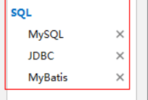

# MyBatis

MyBatis 是java最常用的数据库持久框架,并且MyBatis 提供了一台自动化配置方案可以在SpringBoot环境下做到开箱即用

## 配置

### 依赖

```xml
<dependency>
            <groupId>org.mybatis.spring.boot</groupId>
            <artifactId>mybatis-spring-boot-starter</artifactId>
        </dependency>

        <dependency>
            <groupId>mysql</groupId>
            <artifactId>mysql-connector-java</artifactId>
            <scope>runtime</scope>
        </dependency>

        <dependency>
            <groupId>com.alibaba</groupId>
            <artifactId>druid</artifactId>
            <version>1.1.9</version>
        </dependency>
```

或者建立项目时选择



### application.yml添加配置

```yml
spring:
  datasource:
    username: root
    password: root
    url: jdbc:mysql://localhost:3306/mytest?useUnicode=true&characterEncoding=utf-8&useSSL=true&serverTimezone=UTC
    #  高版本 使用 com.mysql.cj.jdbc.Driver
    driver-class-name: com.mysql.jdbc.Driver 
mybatis:
  #Mapper.xml所在位置    
  mapper-locations: classpath:mapping/*Mapper.xml  
  # 要使用的实体类位置  xml里注明后可以不写
  type-aliases-package: com.gushiyu.scaffolding.entity  
  
logging:
  level:
    com:
      example:
        # 显示sql
        mapper : debug

```

### 启动类添加MapperScan("Dao接口所在包")

```java
@MapperScan("Dao接口所在包")
@SpringBootApplication
public class ScaffoldingApplication {

    public static void main(String[] args) {
        SpringApplication.run(ScaffoldingApplication.class, args);
    }

}
```

## 使用

### 编写 Dao接口

在Dao接口所在包 编写对应的类,实现功能并标注注解`@Repository`  **或者添加 `@mapper `  后不需要在启动类(或配置类)添加 @MapperScan("Dao接口所在包")**

```java
@mapper 
public interface LaptopDao {

    Laptop findLaptopByModel(String model);

    List<Laptop> findLaptopByPrice(Double price);

    Integer insertLaptop(Laptop laptop);

    Integer deleteLaptopByModel(String model);

    Integer updateLaptopPriceByModel(Laptop laptop);
}
```

### 编写与Dao接口对应的xml文件

在配置的`mapper-locations: classpath:mapping/*Mapper.xml ` 对应目录下创建对应  *Mapper.xml  文件

```xml
<?xml version="1.0" encoding="UTF-8" ?>
<!DOCTYPE mapper
        PUBLIC "-//mybatis.org//DTD Mapper 3.0//EN"
        "http://mybatis.org/dtd/mybatis-3-mapper.dtd">
<!-- namespace：命名空间，做sql隔离 -->
<mapper namespace="这里要表明是哪个Dao接口">
    <!--
    id：sql语句唯一标识
    parameterType：指定传入参数类型（pojo类中对应的类型，不是数据库中的类型）
    resultType：返回结果集类型
    #{}：占位符，如果传入的类型是基本类型（string，long，double，int，boolean，float等），那么#{}中变量名称可以任意
     -->
    <select id="findLaptopByModel" parameterType="java.lang.String" resultType="返回值类型等需要更改">
        SELECT * FROM laptop WHERE model=#{model}
    </select>

    <!--
    如果返回的结果为集合，resultType中也是配置为集合中泛型的类型，即resultType="cn.itheima.pojo.User"
    ${}：拼接符，如果传入的类型是基本类型（string，long，double，int，boolean，float等），那么${}中变量名称必须是value
     -->
    <select id="findLaptopByPrice" parameterType="java.lang.Double" resultType="com.gushiyu.scaffolding.entity.Laptop">
        SELECT * FROM laptop WHERE price = #{price}
    </select>

    <!--如果传入的是pojo对象类型，则#{}中变量名称必须是pojo中对应的属性.属性.属性......
    如果要返回数据库自增主键，可以使用SELECT LAST_INSERT_ID()-->
    <insert id="insertLaptop" parameterType="gushiyu.po.Laptop">
        &lt;!&ndash; 执行SELECT LAST_INSERT_ID()数据库函数，返回自增的主键
            keyProperty：将返回的主键放入传入的参数的Id中保存（保存到user对象中的id属性）
            order：当前函数相对于insert语句的执行顺序，在insert前执行用BEFORE，在insert后执行用AFTER
            resultType：id的类型，也就是keyProperty中属性类型
         &ndash;&gt;
        <selectKey keyProperty="id" order="AFTER" resultType="java.lang.Integer">
            SELECT LAST_INSERT_ID()
        </selectKey>
        INSERT INTO user (username,birthday,sex,address) VALUES (#{username},#{birthday},#{sex},#{address})
    </insert>


    <insert id="insertLaptop" parameterType="com.gushiyu.scaffolding.entity.Laptop">
        INSERT INTO laptop (model,speed,ram,hd,screen,price) VALUES (#{model},#{speed},#{ram},#{hd},#{screen},#{price})
    </insert>

    <delete id="deleteLaptopByModel" parameterType="java.lang.String">
        DELETE FROM laptop WHERE model=#{model}
    </delete>

    <update id="updateLaptopPriceByModel" parameterType="com.gushiyu.scaffolding.entity.Laptop">
        UPDATE laptop SET  price=#{price} WHERE model=#{model}
    </update>
</mapper>
```

### 编写对应的`controller` `service` `entity`类

对应包下编写调用即可

```java
//service
@Service
public class TestmybatisService {

    @Autowired
    private LaptopDao laptopDao;

    public Laptop selectLaptop(String model){
        return laptopDao.findLaptopByModel(model);
    }
}

//controller
@RestController
@RequestMapping("/mybatis")
public class TestMybatisController {

    @Autowired
    private TestmybatisService testmybatisService;

    @RequestMapping(value = "/select")
    public Laptop testSelect(String model){
        return testmybatisService.selectLaptop(model);
    }

```

测试运行即可