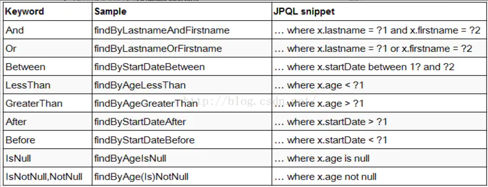
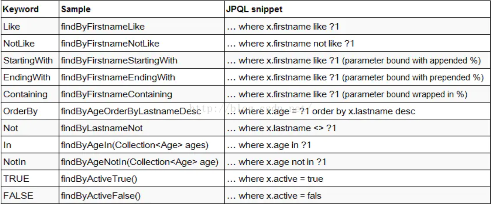

# SpringDataJPA

JPA是一种ORM规范,由Hibernate的作者起草, (Hibernate 也是其实现) 

SpringData是Spring 的一个子项目致力于简化数据库的访问,通过规范命名来分析开发者的意图,进而减少数据库访问层的代码量,而SpringDataJPA可以有效的简化关系数据库的访问

## 配置

### 创建数据库

创建数据库,秩序创建数据库,不需要创建表

### 依赖

```xml
<dependency>
            <groupId>org.springframework.boot</groupId>
            <artifactId>spring-boot-starter-data-jpa</artifactId>
        </dependency>
        <dependency>
            <groupId>org.springframework.boot</groupId>
            <artifactId>spring-boot-starter-web</artifactId>
        </dependency>

        <dependency>
            <groupId>mysql</groupId>
            <artifactId>mysql-connector-java</artifactId>
            <scope>runtime</scope>
        </dependency>

        <dependency>
            <groupId>com.alibaba</groupId>
            <artifactId>druid</artifactId>
            <version>1.1.9</version>
        </dependency>
```

application.properties 配置

```properties
spring.datasource.driver-class-name=com.mysql.cj.jdbc.Driver
spring.datasource.type=com.alibaba.druid.pool.DruidDataSource
spring.datasource.username=root
spring.datasource.password=root
spring.datasource.url=jdbc:mysql://localhost:3306/jpademo?useUnicode=true&characterEncoding=utf-8&useSSL=true&serverTimezone=UTC
spring.jpa.show-sql=true
# jpa 数据库
spring.jpa.database=mysql
# 在项目启动时根据实体类更新数据库表(create,create-drop,validate,no)
spring.jpa.hibernate.ddl-auto=update
spring.jpa.database-platform=mysql
# 一定要指定不指定会报错
spring.jpa.properties.hibernate.dialect=org.hibernate.dialect.MySQL8Dialect
```

## 使用

### 创建实体类

```java
@Entity(name = "t_boook")
@Data
public class Book {

    @Id   //表示主键
    @GeneratedValue(strategy = GenerationType.IDENTITY)   //表示主键自动生成及指定生成策略
    private Integer id;

    @Column(name = "book_name",nullable = false)  // 定制字段的属性 name名称,nullable表示是否为空值
    private String name;

    private String author;

    @Transient  //生成表时忽略该属性
    private String des;
}
```

### 创建Dao接口

Dao 接口应继承 `JpaRepository` ,其实现了大量的基本数据操作,增删改 

```java
public interface BookDao extends JpaRepository<Book,Integer> {
    //Book 为实体类类型,Integer 为主键类型
    List<Book> getBooksByAuthorStartingWith(String author);

    List<Book> getBooksByName(String name);

    @Query(value = "select * from t_book where id=(select max(id) from t_book )"
    ,nativeQuery = true)    //nativeQuery = true 代表sql语句为原生sql
    Book getMaxBook();

    /**
     * 以下是JPQL查询
     */
    //使用 :id 取得参数  使用 @Param("author") 指定参数名称
    @Query("select b from t_book b where b.id=:id and b.author = :author ")
    List<Book> getBooksByIdAndAuthor(@Param("author") String author,@Param("id") Integer id);

    //是用  ?1 取得参数  从一开始
    @Query("select b  from t_book b where b.id = ?1 and b.name like %?2%")
    List<Book> getBooksByIdAndName(@Param("id") Integer id,@Param("name") String name);

}
```

<span style="color:red;font-size:30px" >注意</span>

**在Spring Data JPA 中只要方法符合规范 Spring Data 就能分析出开发者的意图从而避免开发者定义SQL**

**注意JPQL不支持INSERT操作**

**在@Query注解中编写JPQL实现DELETE和UPDATE操作的时候必须加上@modifying注解，以通知Spring Data 这是一个DELETE或UPDATE操作 , <span style="color:red;font-size:20px" >这时应该在service 上加上事务</span>**  否则会报错

#### 规范





### 创建Service

```java
@Service
public class Bookservice {
    @Autowired
    BookDao bookDao;

    public void addBook(Book book){
        bookDao.save(book);
    }

    public Page<Book> getBookByPage(Pageable pageable){
        return bookDao.findAll(pageable);
    }

    public Book getMaxBook(){
        return bookDao.getMaxBook();
    }

    public List<Book> getBooksByIdAndAuthor(String author, Integer id){
        return bookDao.getBooksByIdAndAuthor(author, id);
    }

    public List<Book> getBooksByName(String name){
        return bookDao.getBooksByName(name);
    }

}
```

创建controller 并测试

```java
//插入
        Book b = new Book();
        b.setAuthor("张三");
        b.setName("朝花夕拾");
        bookservice.addBook(b);

        //分页查询
        PageRequest p = PageRequest.of(0,3);
        Page<Book> s = bookservice.getBookByPage(p);
        System.out.println("总页数:"+s.getTotalPages());
        System.out.println("总记录数"+s.getTotalElements());
        System.out.println("查询结果"+s.getContent());
        System.out.println("当前页数"+ (s.getNumber()-1));
        System.out.println("当前页记录数"+s.getNumberOfElements());
        System.out.println("每页记录数"+s.getSize());

        //其他查询
        Book a = bookservice.getMaxBook();
        System.out.println("MAXbook = " + a.getAuthor());

        List<Book> c = bookservice.getBooksByIdAndAuthor("张三", 1);
        for (Book book : c) {
            System.out.println(book.getName());
        }
```

