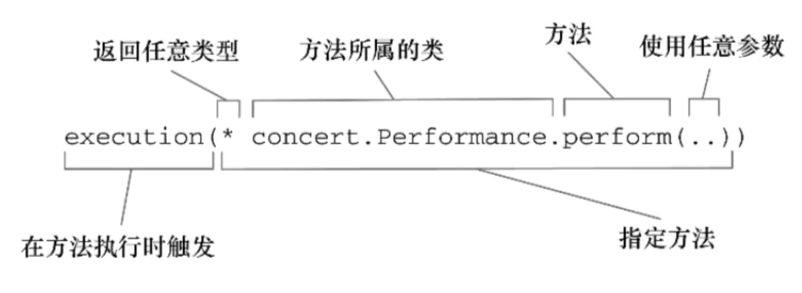
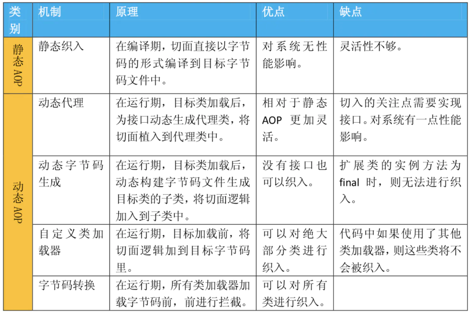

# AOP 切面

AOP是一种编程范式，与语言无关，是一种程序设计思想。
 面向切面编程（AOP）Aspect Oriented Programming。
 切面编程的目的是为了把通用逻辑从业务逻辑分离出来。

先来看看切面的常用术语：

Join point: (拦截点)，如某个业务方法。

Pointcut:(切入点) Joinpoint 的表达式，表示拦截哪些方法。一个 Pointcut 对应多个 Joinpoint。

Advice:(通知) 要切入的逻辑。就是拦截之后需要做的事情

Aspect:(切面)  就是 切入点和通知的结合

Target:(目标对象) 要增强的类

切入时机

-   BeforeAdvice 在方法前切入。
-   After Advice 在方法后切入，抛出异常时也会切入。
-    AfterReturningAdvice 在方法返回后切入，抛出异常则不会切入。
-   AfterThrowingAdvice 在方法抛出异常时切入。
-   Around Advice 在方法执行前后切入，可以中断或忽略原有流程的执行。

## **aop切入点表达式**



## **java AOP 实现方式**



## spring boot 当中的aop

spring boot 在spring 的基础上为AOP 提供了自动化配置

依赖:

```xml
<dependency>
            <groupId>org.springframework.boot</groupId>
            <artifactId>spring-boot-starter-aop</artifactId>
</dependency>
```

编写切面:

```java
//切面
@Aspect
@Component
public class LogAspect {

    @Pointcut("execution(* org.gushiyu.springdemo1.service.*.*(..))")
    public void pc1() {
        System.out.println("拦截点");
    }  //拦截点

    @Before("pc1()")
    public void before(@NotNull JoinPoint joinPoint) {
        joinPoint.getArgs();//参数
        String name = joinPoint.getSignature().getName();//切入方法名称
        System.out.println(name + "前置通知");
    }

    @After("pc1()")
    public void after(@NotNull JoinPoint joinPoint) {
        String name = joinPoint.getSignature().getName();//切入方法名称
        System.out.println(name + "后置通知");
    }

    @AfterReturning(value = "pc1()", returning = "res")
    public void afterReturning(JoinPoint joinPoint, Object res) {
        System.out.println("后置正常返回通知");
    }

    @AfterThrowing(value = "pc1()", throwing = "e")
    public void afterThrowing(JoinPoint joinPoint, Exception e) {
        System.out.println("后置错误通知");
    }

    @Around("pc1()")
    public Object around(ProceedingJoinPoint joinPoint) throws Throwable {
        System.out.println("环绕通知 前");
        Object o = joinPoint.proceed();
        System.out.println("环绕通知 后");
        return o;
    }

}
```

执行 `execution(* org.gushiyu.springdemo1.service.*.*(..))` 方法时候的顺序

```tex
环绕通知 前
testAspectService前置通知
后置正常返回通知
testAspectService后置通知
环绕通知 后
```

