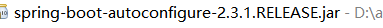
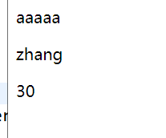

# Freemaker

Freemakers是一个非常古老的模板引擎,可以用在web和非web环境中.他不仅可以作为html模板,还可以作为电子邮件,配置文件,及其他文本文件的模板.

## pom 依赖

和Thymeleaf 一样,添加响应的freemaker-stater 即可

```xml
 <dependency>
            <groupId>org.springframework.boot</groupId>
            <artifactId>spring-boot-starter-web</artifactId>
        </dependency>
        
        <dependency>
        	<groupId>org.springframework.boot</groupId>
        	<artifactId>spring-boot-starter-freemarker</artifactId>
        </dependency>
        
```

## 配置freemarker

包中有关于freemaker 的相关配置

自动配置类:   `FreeMarkerAutoConfiguration`

```java
/**
 * {@link EnableAutoConfiguration Auto-configuration} for FreeMarker.
 *
 * @author Andy Wilkinson
 * @author Dave Syer
 * @author Kazuki Shimizu
 * @since 1.1.0
 */
@Configuration(proxyBeanMethods = false)
@ConditionalOnClass({ freemarker.template.Configuration.class, FreeMarkerConfigurationFactory.class })
@EnableConfigurationProperties(FreeMarkerProperties.class)
@Import({ FreeMarkerServletWebConfiguration.class, FreeMarkerReactiveWebConfiguration.class,
		FreeMarkerNonWebConfiguration.class })
public class FreeMarkerAutoConfiguration {
```

properties 类: `FreeMarkerProperties`

```java
@ConfigurationProperties(prefix = "spring.freemarker")
public class FreeMarkerProperties extends AbstractTemplateViewResolverProperties {

	public static final String DEFAULT_TEMPLATE_LOADER_PATH = "classpath:/templates/";

	public static final String DEFAULT_PREFIX = "";

	public static final String DEFAULT_SUFFIX = ".ftlh";

	/**
	 * Well-known FreeMarker keys which are passed to FreeMarker's Configuration.
	 */
	private Map<String, String> settings = new HashMap<>();

	/**
	 * Comma-separated list of template paths.
	 */
	private String[] templateLoaderPath = new String[] { DEFAULT_TEMPLATE_LOADER_PATH };

	/**
	 * Whether to prefer file system access for template loading. File system access
	 * enables hot detection of template changes.
	 */
	private boolean preferFileSystemAccess = true;


```

相关配置可以再 `FreeMarkerProperties` 中找到

部分常见配置:

```properties
#  httpservletRequest 属性可以覆盖controller中的model 的同名项
spring.freemarker.allow-request-override=false
#  httpsession 属性可以覆盖controller中的model 的同名项
spring.freemarker.allow-session-override=false
#  是否开启缓存
spring.freemarker.cache=true
# 模板文件编码
spring.freemarker.charset=UTF-8
# 是否检查模板文件位置
spring.freemarker.check-template-location=true
# cintent-type 值
spring.freemarker.content-type=text/html; charset=utf-8
#  是否将httpservletRequest中的属性加入到Model中
spring.freemarker.expose-request-attributes=false
#  是否将httpsession中的属性加入到Model中
spring.freemarker.expose-session-attributes=false
# 模板文件后缀
spring.freemarker.suffix=.ftl
# 模板文件位置
spring.freemarker.template-loader-path=classpath:/templates/
```

## 使用 freemarker 模板

控制器: `FreeMarkerController`

```java
@Controller
public class FreeMarkerController {

	@Autowired
	Book book;
	
	public ModelAndView	 testFreeMarker(ModelAndView mv) {
		mv.addObject("obj", book);
		mv.setViewName("FreeMarker");
		return mv;
	}
}
```

模板文件   `FreeMarker.ftl`

```html
<!DOCTYPE html>
<html>
<head>
<meta charset="UTF-8">
<title>FreeMarker</title>
</head>
<body>


<p>${obj.name}</p>
<p>${obj.author}</p>
<p>${obj.price}</p>

</body>
</html>
```

运行

