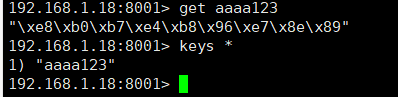
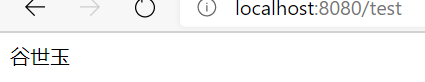

# Redis

Redis 的安装及集群搭建方案查看redis相关文章

spring boot 借助于 spring data redis 对 redis 提供了开箱即用的自动化配置

## 配置

### 依赖

```xml
<dependency>
            <groupId>org.springframework.boot</groupId>
            <artifactId>spring-boot-starter-data-redis</artifactId>
        </dependency>
        <dependency>
            <groupId>org.springframework.boot</groupId>
            <artifactId>spring-boot-starter-web</artifactId>
        </dependency>
```

相关自动配置位于`org.springframework.boot.autoconfigure.data.redis` 下 , redis 在 properties中可以配置的属性位于 `RedisProperties` 前缀 `spring.redis`

`springBootDataRedis` 默认使用的是 `jedis` 驱动 ,springboot 2.0以后的版本使用的是`Lettuce` 驱动 我们可以排除`jedis`或 `Lettuce` 选用去他的

**redis 自动配置`RedisAutoConfiguration`**

```java

@Configuration(
    proxyBeanMethods = false
)
@ConditionalOnClass({RedisOperations.class})
@EnableConfigurationProperties({RedisProperties.class})
@Import({LettuceConnectionConfiguration.class, JedisConnectionConfiguration.class})
public class RedisAutoConfiguration {
	//注入了 RedisTemplate
	//注入了 StringRedisTemplate
}
```

### application.properties

```properties
#reids 库编号
spring.redis.database=0
spring.redis.host=localhost
spring.redis.port=6379
spring.redis.password=12345
# 最大连接数 负数不受限制
spring.redis.jedis.pool.max-active=8
# 最大空闲连接数
spring.redis.jedis.pool.max-idle=8
# 最大阻塞等待时间 默认-1没有限制
spring.redis.jedis.pool.max-wait=1ms
# 连接池最小空闲连接数
spring.redis.jedis.pool.min-idle=0
```

## 使用

编写entity

```java
public class Book  implements Serializable {

    private Integer id;
    private String name;
    private String author;
```

创建controller

```java
@Autowired
    RedisTemplate redisTemplate;

    @Autowired
    StringRedisTemplate stringRedisTemplate;


    @RequestMapping("/test")
    public Object test() {
        ValueOperations<String, String> ops1 = stringRedisTemplate.opsForValue();

        ops1.set("name", "1111红楼梦.+-*!@#$%");
        System.out.println(ops1.get("name"));

        ValueOperations<String, Book> ops2 = redisTemplate.opsForValue();
        Book book = new Book();
        book.setId(1);
        book.setName("!@#$%^123朝花夕拾");
        book.setAuthor("鲁迅");

        ops2.set("book", book);

        return ops2.get("book");
    }
```

打开reids 测试

# redis集群配置

现有集群  `192.168.1.18:8000` -  `8005 ` 

## 配置 

### 依赖

```xml
<dependency>
            <groupId>org.springframework.boot</groupId>
            <artifactId>spring-boot-starter-data-redis</artifactId>
        </dependency>
        <dependency>
            <groupId>org.springframework.boot</groupId>
            <artifactId>spring-boot-starter-web</artifactId>
        </dependency>
        <!-- 连接池 -->
        <dependency>
            <groupId>org.apache.commons</groupId>
            <artifactId>commons-pool2</artifactId>
        </dependency>
```

### application.yml  

集群信息是用 yml可以很方便的配置

```java
spring:
  redis:
    Cluster:
      nodes:
        - 192.168.1.18:8000
        - 192.168.1.18:8001
        - 192.168.1.18:8002
        - 192.168.1.18:8003
        - 192.168.1.18:8004
        - 192.168.1.18:8005
      maxRedirects: 3
    lettuce:
      pool:
        max-idle: 8
        max-wait: -1
        min-idle: 0
    password: root
```

更多配置查看 `RedisProperties` 类

## 自动配置原理

集群配置主要注入的对象

 `RedisClusterConfiguratibon` 

在 `RedisConnectionConfiguration` 类计其继承类中被注入进去

```java
//RedisConnectionConfiguration 类中的方法
protected final RedisClusterConfiguration getClusterConfiguration() {
		if (this.clusterConfiguration != null) {
			return this.clusterConfiguration;
		}
		if (this.properties.getCluster() == null) {
			return null;
		}
		RedisProperties.Cluster clusterProperties = this.properties.getCluster();
		RedisClusterConfiguration config = new RedisClusterConfiguration(clusterProperties.getNodes());
		if (clusterProperties.getMaxRedirects() != null) {
			config.setMaxRedirects(clusterProperties.getMaxRedirects());
		}
		if (this.properties.getPassword() != null) {
			config.setPassword(RedisPassword.of(this.properties.getPassword()));
		}
		return config;
	}
```

在`RedisConnectionConfiguration` 子类 `LettuceConnectionConfiguration` 和 `jedis` 的子类中用来构建

`RedisConnectionFactory`  类 或者子类 `LettuceConnectionFactory` 

```java
//LettuceConnectionConfiguration 类中的createLettuceConnectionFactory
private LettuceConnectionFactory createLettuceConnectionFactory(LettuceClientConfiguration clientConfiguration) {
		if (getSentinelConfig() != null) {
			return new LettuceConnectionFactory(getSentinelConfig(), clientConfiguration);
		}
		if (getClusterConfiguration() != null) {
			return new LettuceConnectionFactory(getClusterConfiguration(), clientConfiguration);
		}
		return new LettuceConnectionFactory(getStandaloneConfig(), clientConfiguration);
	}
@Bean
@ConditionalOnMissingBean(RedisConnectionFactory.class)  //调用了上面的方法并注入了对象
	LettuceConnectionFactory redisConnectionFactory(
			ObjectProvider<LettuceClientConfigurationBuilderCustomizer> builderCustomizers,
			ClientResources clientResources) throws UnknownHostException {
		LettuceClientConfiguration clientConfig = getLettuceClientConfiguration(builderCustomizers, clientResources,
				getProperties().getLettuce().getPool());
		return createLettuceConnectionFactory(clientConfig);
	}
```

在类 `RedisAutoConfiguration` 中 使用了 `@Import({ LettuceConnectionConfiguration.class, JedisConnectionConfiguration.class })`  将两个类注入到其中

`RedisAutoConfiguration`  也提供了 `StringRedisTemplate` 和 `RedisTemplate`两个

所以在我们需要定制的时候可以通过提供需要的类来配置cluster

## 使用

创建controller 注入 `StringRedisTemplate` 和 `RedisTemplate` 测试即可

```java
	@Autowired
    RedisTemplate redisTemplate;

    @Autowired
    StringRedisTemplate stringRedisTemplate;

    @RequestMapping("/test")
    public Object test(){
        ValueOperations<String, String> opsv = stringRedisTemplate.opsForValue();
        opsv.set("aaaa123","谷世玉");
        return opsv.get("aaaa123");
    }
```

结果





