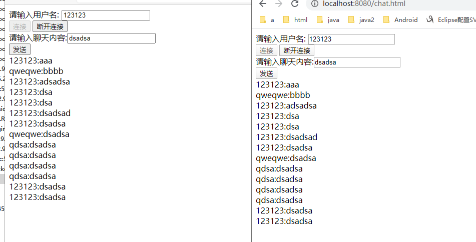

# Spring Boot 集成 WebSocket STOMP功能

## 消息群发

### maven依赖

```xml
<dependency>
            <groupId>org.springframework.boot</groupId>
            <artifactId>spring-boot-starter-web</artifactId>
        </dependency>
        <dependency>
            <groupId>org.springframework.boot</groupId>
            <artifactId>spring-boot-starter-websocket</artifactId>
        </dependency>
        <dependency>
            <groupId>org.webjars</groupId>
            <artifactId>webjars-locator-core</artifactId>
        </dependency>
        <dependency>
            <groupId>org.webjars</groupId>
            <artifactId>sockjs-client</artifactId>
            <version>1.1.2</version>
        </dependency>

        <dependency>
            <groupId>org.webjars</groupId>
            <artifactId>stomp-websocket</artifactId>
            <version>2.3.3</version>
        </dependency>

        <dependency>
            <groupId>org.webjars</groupId>
            <artifactId>jquery</artifactId>
            <version>3.3.1</version>
        </dependency>
```

`spring-boot-starter-websocket` 是WebSocket依赖 其他的都是前端jar包

### 配置WebSocket

spring框架提供了基于WebSocket 的STOMP 支持STOMP 是一个简单的可互操作的协议,通常被用于通过中间服务器在客户端之间进行异步消息传递

[STOMP详解](https://blog.csdn.net/jhfyuf/article/details/86800382) 

```java
@Configuration
@EnableWebSocketMessageBroker
public class WebSocketConfig implements WebSocketMessageBrokerConfigurer {


    @Override
    public void configureMessageBroker(MessageBrokerRegistry registry) {
        registry.enableSimpleBroker("/topic");
        registry.setApplicationDestinationPrefixes("/app");
    }

    @Override
    public void registerStompEndpoints(StompEndpointRegistry registry) {
        registry.addEndpoint("chat").withSockJS();

    }
}
```

`@EnableWebSocketMessageBroker` 表示开启WebSocket消息代理

### 定义Controller

```java
@Controller
public class GreetingController {

    /**
     *
     * @MessageMapping("/hello") 用来接收/app/hello路径发送的消息
     * 在由 @SendTo("/topic/greetings") 进行转发 到 /topic/greetings 路径上
     * 而 @SendTo定义的是 /topic 路径 所以此消息将交给消息代理 broker 在由 broker进行广播
     *
     *
     * @param message
     * @return
     * @throws Exception
     */
    @MessageMapping("/hello")
    @SendTo("/topic/greetings")
    public Message greeting(Message message) throws Exception {
        return message;
    }


}
```

Message

```java
@Component
public class Message {

    private String name;
    private String content;

    public String getName() {
        return name;
    }

    public void setName(String name) {
        this.name = name;
    }

    public String getContent() {
        return content;
    }

    public void setContent(String content) {
        this.content = content;
    }
}
```

### 构建聊天页面

在resources /static目录下创建chat.html页面作为聊天页面

```html
<!DOCTYPE html>
<html lang="ch">
<head>
    <meta charset="UTF-8">
    <title>chat</title>
    <script src="/webjars/jquery/jquery.min.js"></script>
    <script src="/webjars/sockjs-client/sockjs.min.js"></script>
    <script src="/webjars/stomp-websocket/stomp.min.js"></script>
    <script src="/app.js"></script>
</head>
<body>
<div>
        <label for="name" >请输入用户名: </label> <input type="text" id="name" placeholder="用户名">
</div>

<div>
    <button type="button" id="connect" >连接</button>
    <button type="button" id="disconnect" disabled="disabled">断开连接</button>
</div>

<div id="chat"  style="display: none">
    <div>
        <label>请输入聊天内容:</label><input type="text" id="content" placeholder="请输入聊天内容..">
    </div>

    <button id="send" type="button" >发送</button>

    <div id="greetings">
        <div id="conversation" style="display: none" > 群聊进行中...</div>
    </div>

</div>
</body>
</html>
```

app.js

```js
var stompClient = null;
function setConnected(connected) {
    $('#connect').prop("disabled",connected);
    $('#disconnect').prop("disabled",!connected);

    if(connected){
        $("#conversation").show();
        $("#chat").show();
    }else {
        $("#conversation").hide()
        $("#chat").hide()
    }
    $('#greetings').html('')
}

function connect() {
    if(!$('#name').val()){
        return ;
    }
    var socket = new SockJS('/chat');

    stompClient = Stomp.over(socket);
    stompClient.connect({},function (frame) {
        setConnected(true);
        stompClient.subscribe('/topic/greetings',function (greeting) {
            showGreeting(JSON.parse(greeting.body))
        })
    })
}
function disconnect(){
    if(stompClient !== null){
        stompClient.disconnect();
    }
    setConnected(false);
}
function sendName() {
    stompClient.send('/app/hello',{},JSON.stringify({'name':$('#name').val(),'content':$('#content').val()})
}
function showGreeting(message) {
    $('#greetings').append('<div>'+message.name+":"+message.content+'</div>');

}


$(function (){
    $('#connect').click(function (){connect();});
    $('#disconnect').click(function (){disconnect();});
    $('#send').click(function (){sendName();});
})
```

### 测试

启动项目 使用两个不同的浏览器访问  `http://localhost:8080/chat.html` 发送信息



## 消息点对点发送

上文用到了 `@SendTo` 注解 该注解的功能是将处理好的数据发送到broker 在由broker进行消息广播

springboot 中还提供 `SimpMessagingTemplate` 开发者只需要注入到需要使用的地方就能使用,开发者可以在任何地方发送消息到broker ,也可以发送消息给某一个用户

### 在此前基础上添加security

```xml
<dependency>
            <groupId>org.springframework.boot</groupId>
            <artifactId>spring-boot-starter-security</artifactId>
</dependency>
```

### 改造WebSocketMessageBrokerConfigurer

```java
@Configuration
@EnableWebSocketMessageBroker
public class WebSocketConfig implements WebSocketMessageBrokerConfigurer {


    @Override
    public void configureMessageBroker(MessageBrokerRegistry registry) {
        //表示设置消息代理的前缀,即如果前缀是'/topic' 就会将消息发送到消息代理 'broker' 在由消息代理将消息广播给当前连接的客户端
        registry.enableSimpleBroker("/topic","/queue");
        //表示配置一个或多个前缀,通过这些前缀过滤出需要被注解方法处理的消息
        //例如如果消息是 '/app' 则通过@messagemapping("/app") 进行处理,如果是'/topic' 则通过消息代理进行处理
        registry.setApplicationDestinationPrefixes("/app");
    }

    @Override
    public void registerStompEndpoints(StompEndpointRegistry registry) {
        //表示定义一个前缀为 '/chat' 的endpoint 并开启sockjs 支持
        //sockjs 可以解决浏览器对websocket 的兼容性问题,客户端将通过这里配置的URL来建立WebSocket连接
        registry.addEndpoint("/chat").withSockJS();

    }
}
```

### 对WebSocket的Controller进行改造

```java
@Controller
public class GreetingController {
    
    @Autowired
    SimpMessagingTemplate simpMessagingTemplate;

    /**
     *
     * @MessageMapping("/hello") 用来接收/app/hello路径发送的消息
     * 在由 @SendTo("/topic/greetings") 进行转发 到 /topic/greetings 路径上
     * 而 @SendTo定义的是 /topic 路径 所以此消息将交给消息代理 broker 在由 broker进行广播
     *
     *
     * @param message
     * @return
     * @throws Exception
     */
    @MessageMapping("/hello")
    @SendTo("/topic/greetings")
    public Message greeting(Message message) throws Exception {
        return message;
    }
    
    @MessageMapping("/chat")  //处理 来自 /app/chat 的消息
    public void chat(Principal principal, Chat chat){

        String from = principal.getName();
        chat.setFrom(from);
        /**
         *   convertAndSendToUser 参数
         用户 - 应接收消息的用户。
         目标 - 目标将消息发送给。
         有效载荷 - 有效载荷发送  就是消息本身
         在convertAndSendToUser 方法内部 调用了  convertAndSend 并且将发送地址更改为
         this.destinationPrefix + user + destination
             /user/             +{用户} + /queue/chat

         */
        simpMessagingTemplate.convertAndSendToUser(chat.getTo(),"/queue/chat",chat);
    }
    
}

```

其中  `simpMessagingTemplate.convertAndSendToUser ` 源码

```java
@Override
	public void convertAndSendToUser(String user, String destination, Object payload,
			@Nullable Map<String, Object> headers, @Nullable MessagePostProcessor postProcessor)
			throws MessagingException {

		Assert.notNull(user, "User must not be null");
		Assert.isTrue(!user.contains("%2F"), "Invalid sequence \"%2F\" in user name: " + user);
		user = StringUtils.replace(user, "/", "%2F");
		destination = destination.startsWith("/") ? destination : "/" + destination;
		super.convertAndSend(this.destinationPrefix + user + destination, payload, headers, postProcessor);
	}
```

### 创建页面

```html
<!DOCTYPE html>
<html lang="ch">
<head>
    <meta charset="UTF-8">
    <title>chat</title>

    <script src="/webjars/jquery/jquery.min.js"></script>
    <script src="/webjars/sockjs-client/sockjs.min.js"></script>
    <script src="/webjars/stomp-websocket/stomp.min.js"></script>
    <script src="/chat.js"></script>
</head>
<body>
<div id="chat">
    <div id="chatsContent">
    </div>
    <div>
        请输入聊天内容:
        <input type="text" id="content" placeholder="聊天内容 ">
        目标用户:
        <input type="text" id="to" placeholder="目标用户">
        <button id="send" type="button" >发送</button>
    </div>
</div>
</body>
</html>
```

chat.js 

```js
var stompClient = null;

function connect() {
    var socket  = new SockJS('/chat');
    stompClient = Stomp.over(socket);
    stompClient.connect(
        {},
        function (frame){
            stompClient.subscribe('/user/queue/chat',function (chat){
                showGreeting(JSON.parse(chat.body));
            })
        }
    )
}
function sendMsg(){
    stompClient.send(
        "/app/chat",
        {},
        JSON.stringify({
                'content':$('#content').val(),
                'to':$('#to').val()
            })
        )
}

function showGreeting(message) {
    $('#chatsContent').append('<div>'+message.from+":"+message.content+'</div>');

}


$(function (){
    connect();
    $('#send').click(function (){sendMsg();});
})
```


连接成功后 订阅的地址是 `/user/queue/chat` 发送的地址 ` /app/chat` 