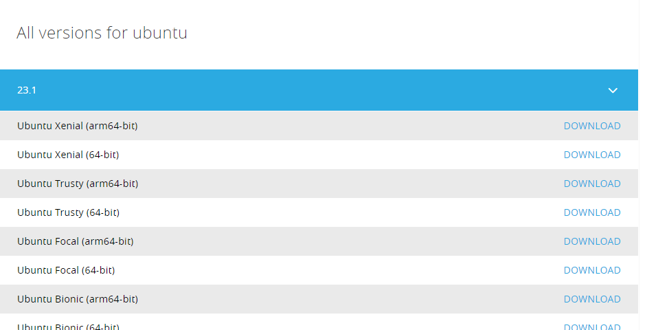
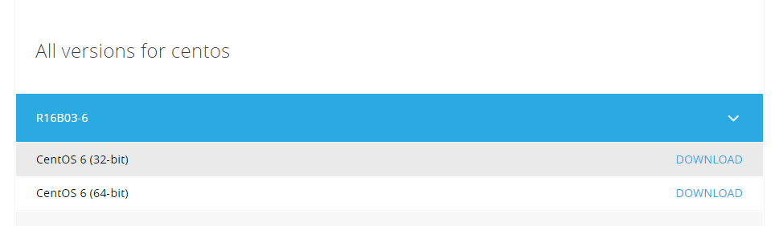
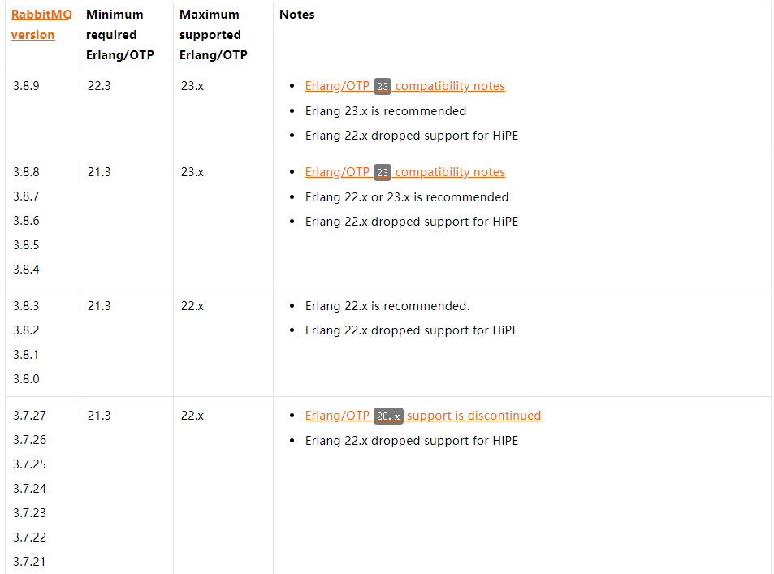

# AMQP-RabbitMQ

AMQP，即Advanced Message Queuing Protocol，一个提供统一消息服务的应用层标准高级[消息](https://baike.baidu.com/item/消息/1619218)队列协议，是[应用层](https://baike.baidu.com/item/应用层/4329788)协议的一个开放标准，为面向消息的中间件设计。基于此协议的客户端与消息中间件可传递消息，并不受客户端/[中间件](https://baike.baidu.com/item/中间件/452240)不同产品，不同的开发语言等条件的限制。[Erlang](https://baike.baidu.com/item/Erlang)中的实现有[RabbitMQ](https://baike.baidu.com/item/RabbitMQ)等。

## AMQP协议

AMQP协议是一个二进制协议，拥有一些现代特点：多信道、协商式、异步、安全、跨平台、中立、高效。

### **AMQP通常被划分为三层：**

模型层定义了一套命令（按功能分类），客户端应用可以利用这些命令来实现它的业务功能。

-   会话层负责将命令从客户端应用传递给服务器，再将服务器的应答传递给客户端应用，会话层为这个传递过程提供可靠性、同步机制和错误处理。
-   传输层提供帧处理、信道复用、错误检测和数据表示。
-   实现者可以将传输层替换成任意传输协议，只要不改变AMQP协议中与客户端应用程序相关的功能。实现者还可以使用其他高层协议中的会话层。

### **AMQP模型的设计由以下几个需求所驱动：**

保证遵从AMQP规范的服务器实现之间能够进行互操作。

为服务质量提供显示控制。

支持所有消息中间件的功能：消息交换、文件传输、流传输、远程进程调用等。

兼容已有的消息API规范（比如Sun公司的JMS规范）。

形成一致和明确的命名。

通过AMQP协议可以完整的配置服务器线路（TODO：server wiring是啥意思？答：服务器连接）。

使用命令符号可以很容易的映射成应用级别的API。

明确定义每一个操作只做一件事情。

AMQP传输层的设计由以下几个主要的需求所驱动，这些需求不分先后次序：

使用能够快速打包解包的二进制编码来保证数据的紧凑性。

能够处理任意大小的消息。

允许零拷贝数据传输（比如远程DMA）。

一个连接支持多个会话。

保证会话能够从网络错误、服务器失效中恢复。

为了长期存在，没有隐含的内置限制（TODO：To be long-lived，with no significant in-built limitations）。

异步传输消息。

能够很容易的处理新的和变化的需求。

高版本的AMQP规范能够兼容低版本的规范。

使用强断言模型来保证应用程序的可修复性。

保持编程语言的中立性。

适宜使用代码生成工具生成协议处理模块。

## RabbitMQ

RabbitMQ 是一个实现了AMQP的开源消息中间件,使用高性能的Erlang编写.RabbitMQ具有可靠性,支持多协议,高可用,支持消息集群,以及多语言客户端等特点,在分布式系统中存储和转发消息,具有不错的性能表现

### 安装

RabbitMQ 使用Erlang编写,因此需要先安装Erlang环境

#### Ubuntu 安装 Erlang

**下载安装包**

到官网下载最新安装包

[Erlang Packages](https://www.erlang-solutions.com/resources/download.html)



**上传到云上**

```shell
root@instance-1ffi07wx:~/Erlang# rz 
root@instance-1ffi07wx:~/Erlang# ls
esl-erlang_23.1-1_ubuntu_xenial_amd64.deb
root@instance-1ffi07wx:~/Erlang# pwd
/root/Erlang
```

**执行安装操作**

安装 `esl-erlang_23.1-1_ubuntu_xenial_amd64.deb`

```shell
root@instance-1ffi07wx:~/Erlang# dpkg -i esl-erlang_23.1-1_ubuntu_xenial_amd64.deb 
Selecting previously unselected package esl-erlang.
(Reading database ... 100706 files and directories currently installed.)
Preparing to unpack esl-erlang_23.1-1_ubuntu_xenial_amd64.deb ...
Unpacking esl-erlang (1:23.1-1) ...
dpkg: dependency problems prevent configuration of esl-erlang:
 esl-erlang depends on libwxbase2.8-0 | libwxbase3.0-0 | libwxbase3.0-0v5; however:
  Package libwxbase2.8-0 is not installed.
  Package libwxbase3.0-0 is not installed.
  Package libwxbase3.0-0v5 is not installed.
 esl-erlang depends on libwxgtk2.8-0 | libwxgtk3.0-0 | libwxgtk3.0-0v5 | libwxgtk3.0-gtk3-0v5; however:
  Package libwxgtk2.8-0 is not installed.
  Package libwxgtk3.0-0 is not installed.
  Package libwxgtk3.0-0v5 is not installed.
  Package libwxgtk3.0-gtk3-0v5 is not installed.
 esl-erlang depends on libsctp1; however:
  Package libsctp1 is not installed.

```

报错,缺少 `libwxbase3.0-0v5` 依赖

```
sudo apt-get install libwxbase3.0-0v5
apt --fix-broken install
# 然后属于 y 同意
```

安装完成后 再来执行 `dpkg -i esl-erlang_23.1-1_ubuntu_xenial_amd64.deb`

```shell
dpkg -i esl-erlang_23.1-1_ubuntu_xenial_amd64.deb
# 安装成功
```

检查

```shell
erl
root@instance-1ffi07wx:~/Erlang# erl
Erlang/OTP 23 [erts-11.1] [source] [64-bit] [smp:1:1] [ds:1:1:10] [async-threads:1] [hipe]
Eshell V11.1  (abort with ^G)
1> 
1> 

```

####  CentOS 安装 Erlang

**下载安装包**

[Erlang Packages](https://www.erlang-solutions.com/resources/download.html)



**上传到云上**

```
rz
ls
esl-erlang_R16B03-6_centos_6_amd64.rpm
```

或者使用 `wget `下载

**执行安装**

```
yum install esl-erlang_22.1-1~centos~7_amd64.rpm
```

**验证**

```
erl -version
```

#### 安装RabbitMQ

版本对应很重要 [版本对应查看](https://www.rabbitmq.com/which-erlang.html)



**下载安装包**

[rabbitmq官网](https://www.rabbitmq.com/download.html)

或使用 `wget` 下载

[3.8.9 下载链接 ](https://github.com/rabbitmq/rabbitmq-server/releases/download/v3.8.9/rabbitmq-server_3.8.9-1_all.deb)

sudo apt-get install man-db


