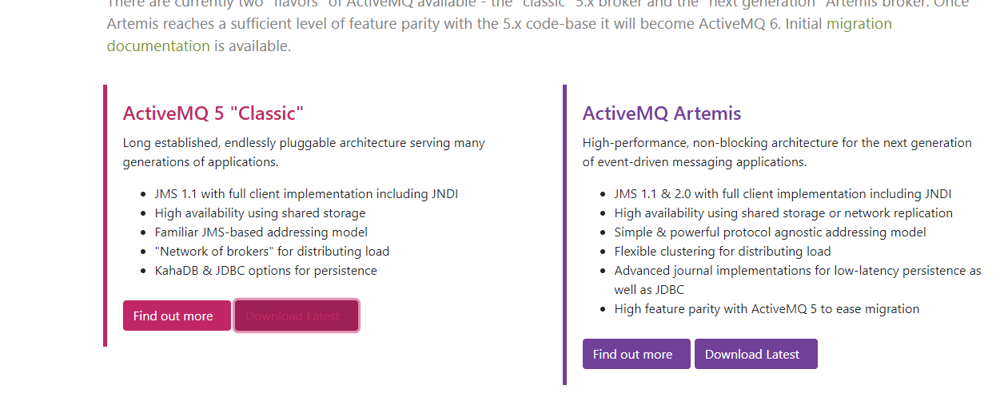

# ActiveMQ

MQ是消息中间件，是一种在分布式系统中应用程序借以传递消息的媒介，常用的有ActiveMQ，RabbitMQ，kafka。ActiveMQ是Apache下的开源项目，完全支持JMS1.1和J2EE1.4规范的JMS Provider实现。 
**特点**： 
支持多种语言编写客户端 
对spring的支持，很容易和spring整合 
支持多种传输协议：TCP, SSL ,NIO ,UDP 等 
支持AJAX  

## ActiveMQ 的消息模式

-   在点对点或队列模型下，一个生产者向一个特定的队列发布消息，一个消费者从该队列中读取消息。这里，生产者知道消费者的队列，并直接将消息发送到消费者的队列。这种模式被概括为：只有一个消费者将获得消息。生产者不需要在接收者消费该消息期间处于运行状态，接收者也同样不需要在消息发送时处于运行状态。每一个成功处理的消息都由接收者签收。
-   发布者/订阅者模型支持向一个特定的消息主题发布消息。0或多个订阅者可能对接收来自特定消息主题的消息感兴趣。在这种模型下，发布者和订阅者彼此不知道对方。这种模式好比是匿名公告板。这种模式被概括为：多个消费者可以获得消息，在发布者和订阅者之间存在时间依赖性。发布者需要建立一个订阅（subscription），以便客户能够购订阅。订阅者必须保持持续的活动状态以接收消息，除非订阅者建立了持久的订阅。在那种情况下，在订阅者未连接时发布的消息将在订阅者重新连接时重新发布。

## 安装

ActiveMQ的安装。官方网址：https://activemq.apache.org/

安装前需要安装 jdk 7 +

### 打开官网



### 选择对应版本


### 下载完成 


### 上传到服务器

```shell
rz apache-activemq-5.16.0-bin.tar.gz
```

### 解压缩

```shell
tar -zxvf apache-activemq-5.16.0-bin.tar.gz
```

### 进入到 bin目录 可以启动,关闭,查看状态 

```shell
启动：./activemq start

停止：./activemq stop

查看状态：./activemq status
```

### 访问 8161 端口 


>   外网访问需要修改 conf/jetty.xml  将其127.0.0.1 修改为 0.0.0.0

## ActiveMQ的编程接口

1.  ConnectionFactory 接口（连接工厂）
        用户用来创建到JMS提供者的连接的被管对象。JMS客户通过可移植的接口访问连接，这样当下层的实现改变时，代码不需要进行修改。 管理员在JNDI名字空间中配置连接工厂，这样，JMS客户才能够查找到它们。根据消息类型的不同，用户将使用队列连接工厂，或者主题连接工厂。
2.  Connection 接口（连接）
        连接代表了应用程序和消息服务器之间的通信链路。在获得了连接工厂后，就可以创建一个与JMS提供者的连接。根据不同的连接类型，连接允许用户创建会话，以发送和接收队列和主题到目标。
3.  Destination 接口（目标）
        目标是一个包装了消息目标标识符的被管对象，消息目标是指消息发布和接收的地点，或者是队列，或者是主题。JMS管理员创建这些对象，然后用户通过JNDI发现它们。和连接工厂一样，管理员可以创建两种类型的目标，点对点模型的队列，以及发布者／订阅者模型的主题。
4.  MessageConsumer 接口（消息消费者）
        由会话创建的对象，用于接收发送到目标的消息。消费者可以同步地（阻塞模式），或异步（非阻塞）接收队列和主题类型的消息。
5.  MessageProducer 接口（消息生产者）
        由会话创建的对象，用于发送消息到目标。用户可以创建某个目标的发送者，也可以创建一个通用的发送者，在发送消息时指定目标。
6.  Message 接口（消息）
        是在消费者和生产者之间传送的对象，也就是说从一个应用程序创送到另一个应用程序。一个消息有三个主要部分：
            消息头（必须）：包含用于识别和为消息寻找路由的操作设置。
            一组消息属性（可选）：包含额外的属性，支持其他提供者和用户的兼容。可以创建定制的字段和过滤器（消息选择器）。
            一个消息体（可选）：允许用户创建五种类型的消息（文本消息，映射消息，字节消息，流消息和对象消息）。
            消息接口非常灵活，并提供了许多方式来定制消息的内容。
7.  Session 接口（会话）
        表示一个单线程的上下文，用于发送和接收消息。由于会话是单线程的，所以消息是连续的，就是说消息是按照发送的顺序一个一个接收的。会话的好处是它支持事务。如果用户选择了事务支持，会话上下文将保存一组消息，直到事务被提交才发送这些消息。在提交事务之前，用户可以使用回滚操作取消这些消息。一个会话允许用户创建消息生产者来发送消息，创建消息消费者来接收消息。

## 编写ActiveMQ 点对点 程序

### maven依赖

```xml
<dependency>
     <groupId>org.apache.activemq</groupId>
     <artifactId>activemq-all</artifactId>
     <version>5.11.2</version>
</dependency>
```

### 生产者程序

```java
package org.gushiyu.activemq;

import org.apache.activemq.ActiveMQConnectionFactory;

import javax.jms.*;

/**
 * @Description
 * @Author Gushiyu
 * @Date 2020-10-10 10:35
 */
public class Producer {

    private String brokerURL = "tcp://106.13.105.114:61616";
    ConnectionFactory connectionFactory;
    Connection connection;

    public Session getSession() throws JMSException {

        // 4、使用Connection对象创建一个Session对象。
        // 参数一是否开启事务，一般不开启事务，保证数据得最终一致性，可以使用消息队列实现数据最终一致性。如果第一个参数为true，第二个参数自动忽略
        // 参数二是消息得应答模式。两种模式，自动应答和手动应答。一般使用自动应答。
        boolean transacted = false;// 不开启事务
        int acknowledgeMode = Session.AUTO_ACKNOWLEDGE;// 1
        return connection.createSession(transacted, acknowledgeMode);
    }

    public void exeQueueTextMessage(String queueName,String s) throws JMSException {
        Session session = getSession();
        MessageProducer producer = session.createProducer(session.createQueue(queueName));
        TextMessage message = session.createTextMessage(s);
        producer.send(message);
        producer.close();
        session.close();
    }


    public Producer(String brokerURL) throws JMSException {
        this.brokerURL = brokerURL;
        connectionFactory = new ActiveMQConnectionFactory(this.brokerURL);
        // 2、使用ConnectionFactory创建一个连接Connection对象。
        connection = connectionFactory.createConnection();

    }

    public Producer() throws JMSException {
        connectionFactory = new ActiveMQConnectionFactory(this.brokerURL);
        // 2、使用ConnectionFactory创建一个连接Connection对象。
        connection = connectionFactory.createConnection();
    }

    public void start() throws JMSException {
        // 3、开启连接。调用Connection对象得start方法。
        connection.start();
    }

    public void close() throws JMSException {
        connection.close();
    }


    public static void main(String[] args) throws JMSException {
        Producer producer = new Producer();
        producer.start();
        producer.exeQueueTextMessage("queue1","this is queue message!");
        producer.close();
    }
}

```

执行完毕后 


### 消费者程序

```java
package org.gushiyu.activemq;

import org.apache.activemq.ActiveMQConnectionFactory;

import javax.jms.*;
import java.io.IOException;
import java.util.*;

/**
 * @Description
 * @Author Gushiyu
 * @Date 2020-10-10 11:01
 */
public class Consumer {

    private String brokerURL = "tcp://106.13.105.114:61616";
    ConnectionFactory connectionFactory;
    Connection connection;
    Map<String, MessageConsumer> map = new HashMap<String,MessageConsumer>();

    public Session getSession() throws JMSException {

        // 4、使用Connection对象创建一个Session对象。
        // 参数一是否开启事务，一般不开启事务，保证数据得最终一致性，可以使用消息队列实现数据最终一致性。如果第一个参数为true，第二个参数自动忽略
        // 参数二是消息得应答模式。两种模式，自动应答和手动应答。一般使用自动应答。
        boolean transacted = false;// 不开启事务
        int acknowledgeMode = Session.AUTO_ACKNOWLEDGE;// 1
        return connection.createSession(transacted, acknowledgeMode);
    }

    public void setQueueMessageListener(String queueName,MessageListener listener) throws JMSException {
        Session session = getSession();
        MessageConsumer consumer = session.createConsumer(session.createQueue(queueName));
        map.put(queueName,consumer);
        consumer.setMessageListener(listener);
    }
    public void stopAllConsumer(){
        map.keySet().iterator().forEachRemaining((e)->{
            try {
                map.get(e).close();
            } catch (JMSException jmsException) {
                jmsException.printStackTrace();
            }
        });
    }


    public Consumer(String brokerURL) throws JMSException {
        this.brokerURL = brokerURL;
        connectionFactory = new ActiveMQConnectionFactory(this.brokerURL);
        // 2、使用ConnectionFactory创建一个连接Connection对象。
        connection = connectionFactory.createConnection();

    }

    public Consumer() throws JMSException {
        connectionFactory = new ActiveMQConnectionFactory(this.brokerURL);
        // 2、使用ConnectionFactory创建一个连接Connection对象。
        connection = connectionFactory.createConnection();
    }

    public void start() throws JMSException {
        // 3、开启连接。调用Connection对象得start方法。
        connection.start();
    }

    public void close() throws JMSException {
        connection.close();
    }

    public static void main(String[] args) throws JMSException {
        Consumer c = new Consumer();
        c.start();
        c.setQueueMessageListener("queue1", new MessageListener() {

            @Override
            public void onMessage(Message message) {
                if(message instanceof TextMessage){
                    String text = null;
                    try {
                        text = ((TextMessage) message).getText();
                    } catch (JMSException e) {
                        e.printStackTrace();
                    }
                    System.out.println(text);
                }
            }
        });

        try {
            System.in.read();
        } catch (IOException e) {
            e.printStackTrace();
        }
        c.stopAllConsumer();
        c.close();
    }

}

```

查看ActiveMQ


## 编写ActiveMQ 发布者订阅者 程序

### 发布者 

`Producer`  增加方法

```java
//     Producer 类
public void exeTopicTextMessage(String topicName ,String s) throws JMSException {
        Session session = getSession();
        MessageProducer producer = session.createProducer(session.createTopic(topicName));
        TextMessage message = session.createTextMessage(s);
        producer.send(message);
        producer.close();
        session.close();
    }
public static void main(String[] args) throws JMSException, InterruptedException {
        Producer producer = new Producer();
        producer.start();
        producer.exeQueueTextMessage("queue1","this is queue message!");
        //发送Topic消息
    	for (int i = 0; i < 1000; i++) {
            Thread.sleep(100);
            producer.exeTopicTextMessage("topic01","this is "+i+"message");
        }

        producer.close();
    }
```

### 订阅者,消费者

`Consumer` 增加方法

```java
//Consumer
public void setTopicMessageListener(String topicName,MessageListener listener) throws JMSException {
        Session session = getSession();
        MessageConsumer consumer = session.createConsumer(session.createTopic(topicName));
        topicMap.put(topicName,consumer);
        consumer.setMessageListener(listener);
    }


public static void main(String[] args) throws JMSException {
        Consumer c = new Consumer();
        c.start();
        c.setQueueMessageListener("queue1", new MessageListener() {

            @Override
            public void onMessage(Message message) {
                if(message instanceof TextMessage){
                    String text = null;
                    try {
                        text = ((TextMessage) message).getText();
                    } catch (JMSException e) {
                        e.printStackTrace();
                    }
                    System.out.println(text);
                }
            }
        });
        c.setTopicMessageListener("topic01", new MessageListener() {
            @Override
            public void onMessage(Message message) {
                if(message instanceof TextMessage){
                    String text = null;
                    try {
                        text = ((TextMessage) message).getText();
                    } catch (JMSException e) {
                        e.printStackTrace();
                    }
                    System.out.println(text);
                }
            }
        });

        try {
            System.in.read();
        } catch (IOException e) {
            e.printStackTrace();
        }
        c.stopAllConsumer();
        c.close();
    }

```

运行程序 两个消费者,一个生产者


### 持久化的订阅

`producer` 开启 setDeliveryMode(DeliveryMode.PERSISTENT)

```java
MessageProducer producer = session.createProducer(dest);
producer.setDeliveryMode(DeliveryMode.PERSISTENT);//持久化
```

## 与spring 整合

```xml
<dependency>
    <groupId>org.springframework</groupId>
    <artifactId>spring-jms</artifactId>
</dependency>
<dependency>
    <groupId>org.springframework</groupId>
    <artifactId>spring-context-support</artifactId>
</dependency>
```

提供`ConnectionFactory` 两个bean

```xml
<!-- 真正可以产生Connection的ConnectionFactory，由对应的 JMS服务厂商提供 -->
    <bean id="targetConnectionFactory"
        class="org.apache.activemq.ActiveMQConnectionFactory">
        <property name="brokerURL"
            value="tcp://192.168.110.142:61616" />
    </bean>

    <!-- Spring用于管理真正的ConnectionFactory的ConnectionFactory -->
    <bean id="connectionFactory"
        class="org.springframework.jms.connection.SingleConnectionFactory">
        <!-- 目标ConnectionFactory对应真实的可以产生JMS Connection的ConnectionFactory -->
        <property name="targetConnectionFactory"
            ref="targetConnectionFactory" />
    </bean>
```

### 生产者配置

```xml
<!-- 3、开始配置生产者配置 -->
    <!-- 配置生产者 -->
    <!-- Spring提供的JMS工具类，它可以进行消息发送、接收等 -->
    <bean id="jmsTemplate"
        class="org.springframework.jms.core.JmsTemplate">
        <!-- 这个connectionFactory对应的是我们定义的Spring提供的那个ConnectionFactory对象 -->
        <!-- 给属性connectionFactory传值 -->
        <property name="connectionFactory" ref="connectionFactory" />
    </bean>

    <!-- 4、配置消息的Destination对象 -->
    <!-- 点对点模式 -->
    <!-- 这个是队列目的地，点对点的。 -->
    <bean id="queueDestination"
        class="org.apache.activemq.command.ActiveMQQueue">
        <constructor-arg>
            <!-- 给ActiveMQQueue构造参数传递一个值为点对点传送的名称 -->
            <value>queue</value>
        </constructor-arg>
    </bean>

    <!-- 发布订阅模式 -->
    <!-- 这个是主题目的地，一对多的。 -->
    <bean id="topicDestination"
        class="org.apache.activemq.command.ActiveMQTopic">
        <!-- 给ActiveMQTopic构造参数传递一个值为 发布的名称 -->
        <constructor-arg value="topic" />
    </bean>
```

### 消费者配置

```xml
<!-- 3、配置消息的Destination对象。接受消息的目的地。 -->
    <!-- 点对点模式 -->
    <!-- 这个是队列目的地，点对点的。 -->
    <bean id="queueDestination"
        class="org.apache.activemq.command.ActiveMQQueue">
        <constructor-arg>
            <!-- 给ActiveMQQueue构造参数传递一个值为queue -->
            <value>queue</value>
        </constructor-arg>
    </bean>

    <!-- 发布订阅模式 -->
    <!-- 这个是主题目的地，一对多的。 -->
    <bean id="topicDestination"
        class="org.apache.activemq.command.ActiveMQTopic">
        <!-- 给ActiveMQTopic构造参数传递一个值为topic -->
        <constructor-arg value="topic" />
    </bean>

    <!-- 4、配置消息接收者 -->
    <!-- 配置一个监听器 -->
	<!-- 自己编写配置到容器中,或者使用注解注入到容器中 -->
    <bean id="activeMqMessageListener"
        class="com.taotao.search.listener.ActiveMqMessageListener" />

    <!-- 配置监听容器 -->
	<!-- 监听容器将监听器和来自ConnectionFactory 的 Destination 绑定起来 -->
    <bean
        class="org.springframework.jms.listener.DefaultMessageListenerContainer">
        <!-- 属性设置 -->
        <!-- 一个是表示从哪里监听的ConnectionFactory -->
        <property name="connectionFactory" ref="connectionFactory" />
        <!-- 一个是表示监听什么的Destination -->
        <property name="destination" ref="queueDestination" />
        <!-- 一个是接收到消息以后进行消息处理的MessageListener -->
        <property name="messageListener" ref="activeMqMessageListener" />
    </bean>
```

## 与SpringBoot整合

AvtiveMQ与SpringBoot整合很简单,SpringBoot提供了stater 

### maven依赖

```xml
<dependency>
            <groupId>org.springframework.boot</groupId>
            <artifactId>spring-boot-starter-activemq</artifactId>
        </dependency>
```

### 配置

```yml
spring:
  activemq:
    broker-url: tcp://192.168.110.142:61616
    packages:
      # 信任所有包
      trust-all: true
    user: admin
    password: admin
```

### 注入Queue 和 Topic

```java
@Configuration
public class MyActiveMQConfig {


    //代表向容器中注入一个queue1 点对点的队列
    @Bean
    public Queue queue(){
        return new ActiveMQQueue("queue1");
    }

    @Bean
    public Topic topic(){
        return new ActiveMQTopic("topic1");

    }

}
```

Message

```java
public class Message implements Serializable {

    private String content;
    private Date date;
	//get set and toString
```


### 编写发送和监听组件

```java
@Component
public class JmsComponent {

    @Autowired
    JmsTemplate jmsTemplate;

    @Autowired
    JmsMessagingTemplate jmsMessagingTemplate;

    @Autowired
    Queue queue;
    
    @Autowired
    Topic topic;

    public void sendQueue(Message message){
        jmsMessagingTemplate.convertAndSend(queue,message);
    }

    public void sendTopic(Message message){
        jmsMessagingTemplate.convertAndSend(topic,message);
    }

    @JmsListener(destination = "queue1")
    public void receiveQueue(Message message){
        System.out.println(message);
    }

    @JmsListener(destination = "topic1")
    public void receiveTopic(Message message){
        System.out.println(message);
    }
    
}

```

`@JmsListener`  监听相应地址的消息消费者

-   `destination`:目的地 

-   `containerFactory `:JmsListenerContainerFactory用于构建JMS侦听容器。 如果没有设置，默认容器厂被认为是可用的bean名称jmsListenerContainerFactory除非明确默认已通过配置提供
-   `subscription` 持久化订阅需要设置该名字，还需要在配置containFactory的时候进行一下配置
-   `selector` 选择器，一个条件表达式，遵循sql 92语法，只会过滤property或者消息头信息，没仔细验证过，估计就是Message里面的getset方法的大部分属性
-   `concurrency` 并发数量的设置，格式 num-num （下限-上限） 或者 num （上限）

`jmsMessagingTemplate` 是Spring 提供的JMS消息发送模板,可以方便的对消息进行发送

### topic消息的收取

上面的配置只能接受queue消息,接受topic消息需要开启下面配置

```yml
jms:
  # 开启Topic模式 ,但是开启了,注解只能够接收topic消息了queue消息接受不到了,所以不开启
  pub-sub-domain: true
```

所以我们使用自定义的`connectionFactory` 

**编写配置类**

```java
@Configuration
public class ConsumerConfig {

    @Value("${spring.activemq.broker-url}")
    private String host;
    
    @Value("${spring.activemq.packages.trust-all}")
    private boolean trustAllPackages;

    @Bean(name = "myActiveMqConnection")
    public ConnectionFactory getActiveMqConnection(){
        ActiveMQConnectionFactory factory = new ActiveMQConnectionFactory(host);
        factory.setTrustAllPackages(trustAllPackages); //设置信任发送的所有包
        return factory;
    }

    @Bean(name="queueListenerContainerFactory")
    public JmsListenerContainerFactory queueListenerContainerFactory(@Qualifier("myActiveMqConnection") ConnectionFactory connectionFactory){
        DefaultJmsListenerContainerFactory factory = new DefaultJmsListenerContainerFactory();
        factory.setConnectionFactory(connectionFactory);
        factory.setPubSubDomain(false);
        return factory;
    }
    
    @Bean(name="topicListenerContainerFactory")
    public JmsListenerContainerFactory topicListenerContainerFactory(@Qualifier("myActiveMqConnection") ConnectionFactory connectionFactory){
        DefaultJmsListenerContainerFactory factory = new DefaultJmsListenerContainerFactory();
        factory.setConnectionFactory(connectionFactory);
        factory.setPubSubDomain(true);
        return factory;
    }
}
```

在`@JmsListener` 中添加属性 `containerFactory` 使用对应的 `ContainerFactory`

此时的`JmsComponent`

```java
@Component
public class JmsComponent {

    @Autowired
    JmsTemplate jmsTemplate;

    @Autowired
    JmsMessagingTemplate jmsMessagingTemplate;

    @Autowired
    Queue queue;

    @Autowired
    Topic topic;

    public void sendQueue(Message message){
        jmsMessagingTemplate.convertAndSend(queue,message);
    }

    public void sendTopic(Message message){
        jmsMessagingTemplate.convertAndSend(topic,message);
    }

    @JmsListener(destination = "queue1",containerFactory = "queueListenerContainerFactory")
    public void receiveQueue(Message message){
        System.out.println(message);
    }

    @JmsListener(destination = "topic1",containerFactory = "topicListenerContainerFactory")
    public void receiveTopic(Message message){
        System.out.println(message);
    }

}
```

### 设置 MessageConverter 

在SpringBoot中默认提供对象,字符串,Map的消息转化 ,所以此案例中不配置

`MessageConverter  消息转换器` 用来将不适配jms `message` 消息的信息转化成jms 的message ,反之也可以

**消息转换器**

实现一个简单的消息转换器

```java
@Component
public class MyMessageConverter implements MessageConverter {
    @Override
    public Message toMessage(Object object, Session session) throws JMSException, MessageConversionException {
        return session.createObjectMessage((Serializable) object);
    }

    @Override
    public Object fromMessage(Message message) throws JMSException, MessageConversionException {
        ObjectMessage objMessage = (ObjectMessage) message;
        return objMessage.getObject();
    }
}
```

**修改`ConsumerConfig` 类**

```java
	@Autowired
    MyMessageConverter myMessageConverter;  //注入自己写的消息转换器

    @Bean(name="queueListenerContainerFactory")
    public JmsListenerContainerFactory queueListenerContainerFactory(@Qualifier("myActiveMqConnection") ConnectionFactory connectionFactory){
        DefaultJmsListenerContainerFactory factory = new DefaultJmsListenerContainerFactory();
        factory.setConnectionFactory(connectionFactory);
        factory.setPubSubDomain(false);
        factory.setMessageConverter(myMessageConverter); ////在这里设置消息转换器
        return factory;
    }
    
    @Bean(name="topicListenerContainerFactory")
    public JmsListenerContainerFactory topicListenerContainerFactory(@Qualifier("myActiveMqConnection") ConnectionFactory connectionFactory){
        DefaultJmsListenerContainerFactory factory = new DefaultJmsListenerContainerFactory();
        factory.setConnectionFactory(connectionFactory);
        factory.setPubSubDomain(true);
        factory.setMessageConverter(myMessageConverter);  //在这里设置消息转换器
        return factory;
    }
```


### 测试

```java
 @Autowired
    JmsComponent jmsComponent;


    @Test
    public void testJms() throws InterruptedException {
        for (int i = 0; i < 100; i++) {
            System.out.println("test:"+i+"/100");
            Date d = new Date();
            
            Thread.sleep(500);
            Message message = new Message();
            message.setDate(d);
            message.setContent("这是queue消息"+i);
            jmsComponent.sendQueue(message);
            Message message2 = new Message();
            message2.setContent("这是topic消息"+i);
            message2.setDate(d);
            jmsComponent.sendTopic(message2);
        }
    }
```

**结果**

```text
test:0/100
MyMessageConverter:toMessage...
Message{content='这是queue消息0', date=Sun Oct 11 19:21:33 CST 2020}
MyMessageConverter:toMessage...
Message{content='这是topic消息0', date=Sun Oct 11 19:21:33 CST 2020}
test:1/100
MyMessageConverter:toMessage...
Message{content='这是queue消息1', date=Sun Oct 11 19:21:34 CST 2020}
MyMessageConverter:toMessage...
Message{content='这是topic消息1', date=Sun Oct 11 19:21:34 CST 2020}
test:2/100
MyMessageConverter:toMessage...
Message{content='这是queue消息2', date=Sun Oct 11 19:21:35 CST 2020}
MyMessageConverter:toMessage...
Message{content='这是topic消息2', date=Sun Oct 11 19:21:35 CST 2020}
test:3/100
MyMessageConverter:toMessage...
Message{content='这是queue消息3', date=Sun Oct 11 19:21:35 CST 2020}
MyMessageConverter:toMessage...
Message{content='这是topic消息3', date=Sun Oct 11 19:21:35 CST 2020}
```


