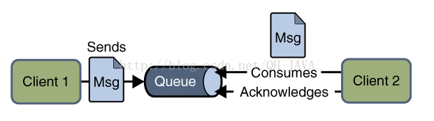
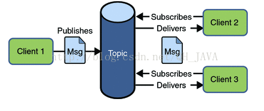
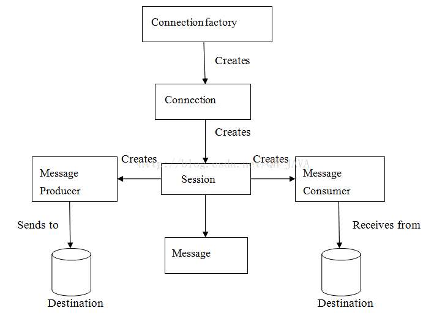

# Java Message Service

JMS即Java消息服务（Java Message Service）应用程序接口，是一个Java平台中关于面向消息中间件（MOM）的API，用于在两个应用程序之间，或分布式系统中发送消息，进行异步通信。Java消息服务是一个与具体平台无关的API，绝大多数MOM提供商都对JMS提供支持。

JMS是一组消息服务的api即接口规范即数据库的JDBC消息服务的JMS。

## 为什么要学习，使用JMS

在JAVA中，如果两个应用程序之间对各自都不了解，甚至这两个程序可能部署在不同的大洲上，那么它们之间如何发送消息呢？举个例子，一个应用程序A部署在印度，另一个应用程序部署在美国，然后每当A触发某件事后，B想从A获取一些更新信息。当然，也有可能不止一个B对A的更新信息感兴趣，可能会有N个类似B的应用程序想从A中获取更新的信息。在这种情况下，JAVA提供了最佳的解决方案-JMS，完美解决了上面讨论的问题。JMS同样适用于基于事件的应用程序，如聊天服务，它需要一种发布事件机制向所有与服务器连接的客户端发送消息。JMS与RMI不同，发送消息的时候，接收者不需要在线。服务器发送了消息，然后就不管了；等到客户端上线的时候，能保证接收到服务器发送的消息。这是一个很强大的解决方案，能处理当今世界很多普遍问题。

## JMS有什么优势

1、异步：JMS天生就是异步的，客户端获取消息的时候，不需要主动发送请求，消息会自动发送给可用的客户端。

2、可靠：JMS保证消息只会递送一次。大家都遇到过重复创建消息问题，而JMS能帮你避免该问题，只是避免而不是杜绝，所以在一些糟糕的环境下还是有可能会出现重复。

## JMS消息传送模型

在JMS API出现之前，大部分产品使用“点对点”和“发布/订阅”中的任一方式来进行消息通讯。JMS定义了这两种消息发送模型的规范，它们相互独立。任何JMS的提供者可以实现其中的一种或两种模型，这是它们自己的选择。JMS规范提供了通用接口保证我们基于JMS API编写的程序适用于任何一种模型。让我们更加详细的看下这两种消息传送模型;

### 点对点消息传送模型（P2P）

在点对点消息传送模型中，应用程序由消息队列，发送者，接收者组成。每一个消息发送给一个特殊的消息队列，该队列保存了所有发送给它的消息(除了被接收者消费掉的和过期的消息)。

**点对点消息模型有如下特性：**

（1）、每个消息只有一个接受者（自己测试了一下，可以有多个接受者，但是当有多个接收者时，每个接收者只能获取随机的几条信息）

（2）、消息发送者和消息接受者并没有时间依赖性。

（3）、当消息发送者发送消息的时候，无论接收者程序在不在运行，都能获取到消息；

（4）、当接收者收到消息的时候，会发送确认收到通知（acknowledgement）。

（5）、点对点消息模型图：



### 发布/订阅消息传送模型

在发布/订阅消息模型中，发布者发布一个消息，该消息通过topic传递给所有的客户端。在这种模型中，发布者和订阅者彼此不知道对方，是匿名的且可以动态发布和订阅topic。topic主要用于保存和传递消息，且会一直保存消息直到消息被传递给客户端。

**发布/订阅消息模型有如下特性：**

（1）、一个消息可以传递给多个订阅者

（2）、发布者和订阅者有时间依赖性，只有当客户端创建订阅后才能接受消息，且**订阅者需一直保持活动状态以接收消息。**

（3）、为了缓和这样严格的时间相关性，**JMS允许订阅者创建一个可持久化的订阅**。这样，即使订阅者没有被激活（运行），它也能接收到发布者的消息。

（4）、发布/订阅消息模型图：



## 接收消息

在JMS中，消息的接收可以使用以下两种方式：

### 同步方式

使用同步方式接收消息的话，消息订阅者调用receive()方法。在receive()中，消息未到达或在到达指定时间之前，方法会阻塞，直到消息可用。

-   目的地是Queue

```java
consumer = session.createConsumer(queue); 
Message message = consumer.receive(); //同步方式接收 
```

-   目的地是Destination

```java
consumer = session.createConsumer(destination); 
//同步方式接受信息,如果还没有获取到则会阻塞直到接收到信息 
Message messages = consumer.receive(); 
```

### 异步方式

使用异步方式接收消息的话，消息订阅者需注册一个消息监听者，类似于事件监听器，只要消息到达，JMS服务提供者会通过调用监听器的onMessage()递送消息。

异步方式接收是使用了监听方式：


```java
consumer.setMessageListener(new MessageListener(){  
                    @Override  
                    public void onMessage(Message message) {  
                        TextMessage textMessage = (TextMessage)message;  
                        try {  
                            String value = textMessage.getText();  
                            System.out.println("value: "+value);  
                        } catch (JMSException e) {  
                            // TODO Auto-generated catch block  
                            e.printStackTrace();  
                        }  
                    }  
                });  
```


## JMS编程接口

JMS应用程序由如下基本模块组成：

1.  **管理对象（Administered objects）-连接工厂（Connection Factories）和目的地（Destination）**
2.  **连接对象（Connections）**
3.  **会话（Sessions）**
4.  **消息生产者（Message Producers）**
5.  **消息消费者（Message Consumers）**
6.  **消息监听者（Message Listeners）**



7.  **JMS管理对象**

管理对象（Administered objects）是预先配置的JMS对象，由系统管理员为使用JMS的客户端创建，主要有两个被管理的对象：
连接工厂（ConnectionFactory）
目的地（Destination）
这两个管理对象由JMS系统管理员通过使用Application Server管理控制台创建，存储在应用程序服务器的JNDI名字空间或JNDI注册表。

8.  **连接工厂（ConnectionFactory）**

客户端使用一个连接工厂对象连接到JMS服务提供者，它创建了JMS服务提供者和客户端之间的连接。JMS客户端（如发送者或接受者）会在JNDI名字空间中搜索并获取该连接。使用该连接，客户端能够与目的地通讯，往队列或话题发送/接收消息。让我们用一个例子来理解如何发送消息：

9.  **目的地（Destination）**

目的地指明消息被发送的目的地以及客户端接收消息的来源。JMS使用两种目的地，队列和话题。

10.  **JMS连接**

连接对象封装了与JMS提供者之间的虚拟连接，如果我们有一个ConnectionFactory对象，可以使用它来创建一个连接。


```java
        //链接工厂  
        ActiveMQConnectionFactory connectionFactory = null;  
        //链接对象  
        Connection connection = null;  
        connectionFactory = new ActiveMQConnectionFactory("admin","admin","tcp://192.168.1.111:61616");  
        connection = connectionFactory.createConnection();  
            connection.start();  
```


11.  **JMS 会话（Session）**

Session是一个单线程上下文，用于生产和消费消息，可以创建出消息生产者和消息消费者。
Session对象实现了Session接口，在创建完连接后，我们可以使用它创建Session。

```java
			//第一个参数是否开启事务 true开启 ,false不开启事务，如果开启记得手动提交  
            //参数二，表示的是签收模式，一般使用的有自动签收和客户端自己确认签收  
            session = connection.createSession(true, Session.AUTO_ACKNOWLEDGE); 
```

12.  **JMS消息生产者**

消息生产者由Session创建，用于往目的地发送消息。生产者实现MessageProducer接口，我们可以为目的地、队列或话题创建生产者；

1.  队列（Queue）  点对点消息模型

```java
			Queue  queue  = session.createQueue("test_queue");  
            //为队列创建消息生产者  
            MessageProducer producer =  session.createProducer(queue);  
```

2.  目的地（Destination）  点对点消息模型

```java
		Destination destination = session.createQueue("test-queue");  
        //为目的地创建消息生产者  
        MessageProducer producer = session.createProducer(destination);  
```

2.  话题（Topic）  用于发布者/订阅者消息模型上

```java
//创建话题  
      Topic topic = session.createTopic("myTopic.messages");    
      //为话题创建消息生产者  
      MessageProducer producer = session.createProducer(topic);    
```


 		 **发送消息**

```java
			//创建消息  
                TextMessage message = session.createTextMessage();  
                message.setText("测试队列消息"+i);  
                //发送消息到目的地  
                producer.send(message);  
```

13.  **JMS消息消费者**

消息消费者由Session创建，用于接收目的地发送的消息。消费者实现MessageConsumer接口，我们可以为目的地、队列或话题创建消费者；

1.  队列（Queue）

```java
				//队列（目的地，消费者消费消息的地方） 
				Queue queue = session.createQueue("test_queue");  
				//消息消费者  
                MessageConsumer consumer = session.createConsumer(queue);   
```

2.  目的地（Destination）

```java
		//消息目的地  
        Destination destination = session.createQueue("test-queue");  
        //消息消费者  
        MessageConsumer consumer = session.createConsumer(destination);
```

3.  话题（Topic）

```java
		//创建话题  
        Topic topic = session.createTopic("myTopic.messages");   
        //为话题创建消费者  
        MessageConsumer consumer = session.createConsumer(topic);   
```


14.  **JMS消息监听器（消息监听这种方式也就是消息的异步接收方式）**

JMS消息监听器是消息的默认事件处理者，他实现了MessageListener接口，该接口包含一个onMessage方法，在该方法中需要定义消息达到后的具体动作。通过调用setMessageListener方法我们给指定消费者定义了消息监听器.

1.  TextMessage

```java
consumer.setMessageListener(new MessageListener(){  
                    @Override  
                    public void onMessage(Message message) {  
                        TextMessage textMessage = (TextMessage)message;  
                        try {  
                            String value = textMessage.getText();  
                            System.out.println("value: "+value);  
                        } catch (JMSException e) {  
                            // TODO Auto-generated catch block  
                            e.printStackTrace();  
                        }  
                    }  
                });  
```


2.  ObjectMessage

```java
consumer.setMessageListener(new MessageListener(){  
            @Override  
            public void onMessage(Message message){  
                try {  
                TestBean  tbean =(TestBean)((ObjectMessage)message).getObject();  
                System.out.println("tbean: "+tbean);  
                if(null != message) {  
                     System.out.println("收到信息1： "+tbean.getName());  
                }  
                } catch (JMSException e) {  
                    // TODO Auto-generated catch block  
                    e.printStackTrace();  
                }  
            }  
        });  
```

## JMS消息结构

JMS客户端使用JMS消息与系统通讯，JMS消息虽然格式简单但是非常灵活， JMS消息由三部分组成：

### 消息头

| 字段             | 作用                                                         |
| ---------------- | ------------------------------------------------------------ |
| JMSDeliveryMode  | **传送模式**:有两种即久模式和非持久模式。一条持久性的消息应该被传输"一次仅仅一次"，这就意味着如果JMS提供者出现故障，该消息并不会丢失，它会在服务器恢复之后再次传递。一条非持久的消息最多会传递一次，这意味着服务器出现故障，该消息将永远丢失。由session穿件由消息生产者的send方法设置 |
| JMSDestination   | **消息发送的目的地**，主要是指Queue和Topic，由session创建而由生产者的send方法设置 |
| JMSMessageID     | 唯一识别每个消息的**标识**，由JMS消息生产者产生。由send方法设置 |
| JMSTimestamp     | 一个JMS Provider(提供者)在调用send()方法时自动设置，它是消息被发送和消费者实际接收的时间差。由客户端设置 |
| JMSCorrelationID | 用来连接到另外一个消息，典型的应用是在回复消息中连接到原消息。在大多数情况下，JMSCorrelationID用于将一条消息标记为对JMSMessageID标示的上一条消息的应答，不过，JMSCorrelationID可以是任何值，不仅仅是JMSMessageID。由客户端设置 |
| JMSReplyTo       | 提供本消息回复消息的目的地址,由客户端设置                    |
| JMSRedelivered   | 如果一个客户端收到一个设置了JMSRedelivered属性的消息，则表示可能客户端曾经在早些时候收到过该消息，但并没有签收(acknowledged)。如果该消息被重新传送，JMSRedelivered=true 否则 JMSRedelivered=flase 。由JMS Provider设置 |
| JMSType          | 消息类型的标识符，由客户端设置                               |
| JMSExpiration    | 消息过期时间，等于Destination的send方法中的timeToLive值加上发送时刻的GMT的时间值。如果timeToLive值等于零，则JMSExpiration被设置为零，表示该消息永不过期。如果发送后，在消息过期时间之后消息还没有被发送到目的地，则该消息被清除。由send方法设置 |
| JMSPriority      | 消息优先级，从0-9十个级别，0-4是普通消息，5-9是加急消息。JMS不要求JMS Provider严格按照这十个优先级发送消息，但必须保证加急消息要先于普通消息到达，默认是4级。由send方法设置 |

### 消息属性

我们可以给消息设置自定义属性，这些属性主要是提供给应用程序的。对于实现消息过滤功能，消息属性非常有用，JMS API定义了一些标准属性，JMS服务提供者可以选择性的提供部分标准属性。

### 消息体

在消息体中，JMS API定义了五种类型的消息格式，让我们可以以不同的形式发送和接受消息，并提供了对已有消息格式的兼容。不同的消息类型如下：
`Text message` : `javax.jms.TextMessage`，表示一个文本对象。
`Object message` :` javax.jms.ObjectMessage`，表示一个JAVA对象。
`Bytes message` : `javax.jms.BytesMessage`，表示字节数据。
`Stream message` :`javax.jms.StreamMessage`，表示java原始值数据流。
`Map message` : `javax.jms.MapMessage`，表示键值对。

>   [Java Message Service（JMS）总结 : 阳光的亮亮](https://blog.csdn.net/weixin_39352976/article/details/79881352)


